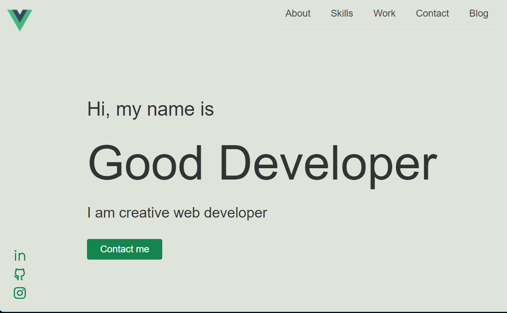

# devPortPage

**devPortPage** is simple starter kit for modern SPA developer personal page.

## Description

This starter kit allows you to quickly create a personal developer presentation that includes sections:

* Home page - introductory performance
* About - personal information
* Skills - A list of skills grouped by type and level
* Work - references to obsessive projects
* Contact - contact information
* Blog - A simple blog for publishing articles

## Technology

As administrtion backend is used [Strapi](https://strapi.io/) - Open source Node.js Headless CMS.

Frontend is based on [Vue.js framework](https://vuejs.org/) and [Chota](https://jenil.github.io/chota/) CSS framework.

## Getting Started

### Prerequisites

**Node.js** only LTS versions are supported (v14 and v16). Other versions of Node.js may not be compatible with the latest release of Strapi. The 14.x version is most recommended by Strapi.

**npm** (v6 only) or **yarn** to run the CLI installation scripts.

### Instalation

Clone this repo

Run

`nom instal`

in admin and client directory to install dependencies

## Usage

### Run Strapi

Run admin panel:

`npm run develop`

Login:

Url: <http://localhost:1337>

Username: admin@devport.net

Passwd: Supeadm0

### Run Frontend

Run client:

`npm run serve`

App running at: http://localhost:8080/

### Customizing

All content, menu, images, files are editable in admin panel.

For basic CSS customizing frontend use variables in
`client/src/assets/css/main.css`

## Licence

Distributed under the MIT License. See license.txt for more information.

## Contact

Autor: Standa Procházka - prochst.dev@gmmail.com

Projekt: [GitHub](https://github.com/prochst/devPortPage)
